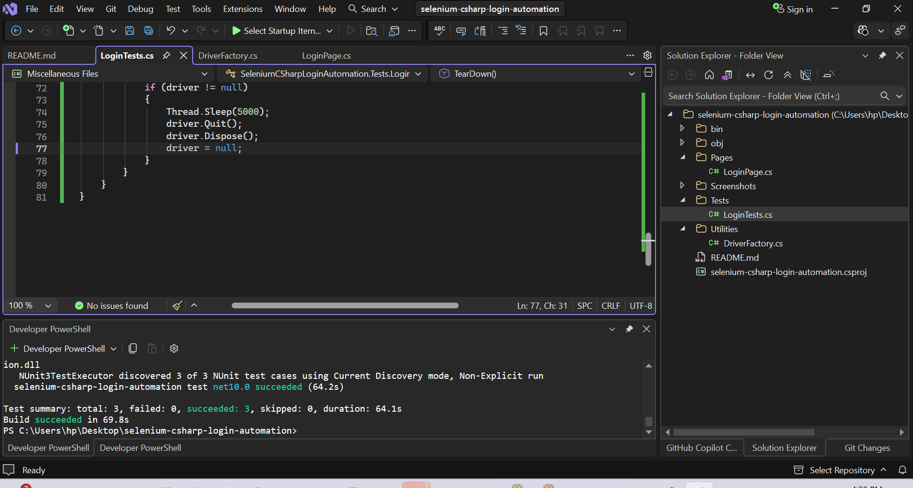

# Selenium C# Login Automation

A simple QA automation project built with **C#**, **Selenium WebDriver**, and **NUnit** using the **Page Object Model (POM)** design pattern.

## Project Overview

This project automates login testing on a sample web application and covers both positive and negative login scenarios. It demonstrates a clean automation structure suitable for QA portfolio presentation.

## Test Execution Result



## Test Execution Result


## Tech Stack

- C#
- .NET
- Selenium WebDriver
- NUnit
- ChromeDriver

## Test Cases Covered

- Valid login with correct credentials
- Invalid login with wrong credentials
- Empty login submission

## Project Structure

```text
selenium-csharp-login-automation/
├── Pages/
│   └── LoginPage.cs
├── Tests/
│   └── LoginTests.cs
├── Utilities/
│   └── DriverFactory.cs
├── Screenshots/
│   └── test-run-results.png
├── README.md
├── .gitignore
└── selenium-csharp-login-automation.csproj